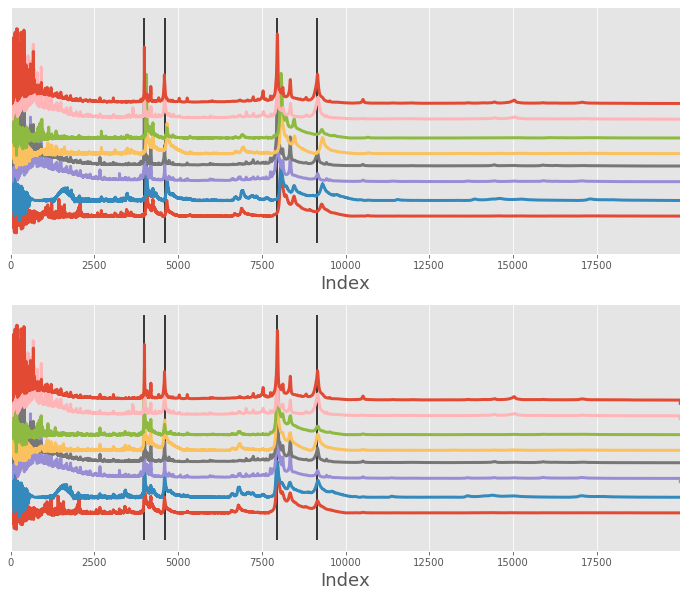
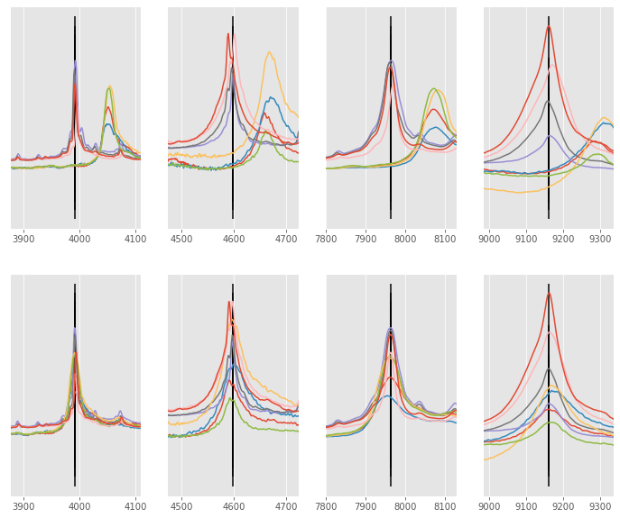

# msalign - signal calibration and alignment

[](https://github.com/lukasz-migas/msalign/actions)
[](https://codecov.io/gh/lukasz-migas/msalign)
[](https://www.codefactor.io/repository/github/lukasz-migas/msalign)
[](https://app.netlify.com/sites/msalign/deploys)

[](https://pypi.org/project/msalign/)
[](https://pypi.org/project/msalign/)
[](https://pypi.org/project/msalign/)
[](https://pepy.tech/project/msalign)

This package was inspired by MATLAB's [msalign](https://mathworks.com/help/bioinfo/ref/msalign.html) function which
allows alignment of multiple signals to reference peaks.

## Installation

Install from PyPi

```python
pip install msalign
```

Install directly from GitHub

```python
pip install -e git+https://github.com/lukasz-migas/msalign.git
```

Install in development mode

```python
python setup.py develop
```

## Usage

Usage is relatively straightforward. Simply import `msalign` from the package and provide `x`, `array`
and `peaks` values. `msalign` accepts a lot of other parameters that might improve your alignment - simply provide them
as `keyword` parameters.

```python
import numpy as np
from msalign import msalign


filename = r"./example_data/msalign_test_data.csv"
data = np.genfromtxt(filename, delimiter=",")
x = data[1:, 0]
array = data[1:, 1:].T
peaks = [3991.4, 4598, 7964, 9160]

aligned = msalign(x, array, peaks, weights=[60, 100, 60, 100], only_shift=False)
```



Zoom-in on each peak the spectrum was aligned against



## Reference

Monchamp, P., Andrade-Cetto, L., Zhang, J.Y., and Henson, R. (2007) Signal Processing Methods for Mass
Spectrometry. In Systems Bioinformatics: An Engineering Case-Based Approach, G. Alterovitz and M.F. Ramoni, eds.
Artech House Publishers).

[MATLAB's msalign](https://mathworks.com/help/bioinfo/ref/msalign.html)
