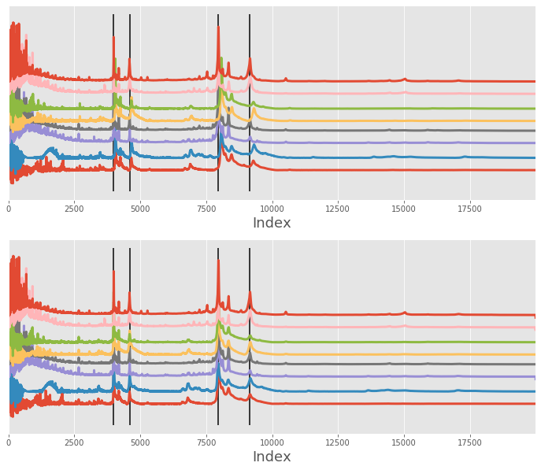
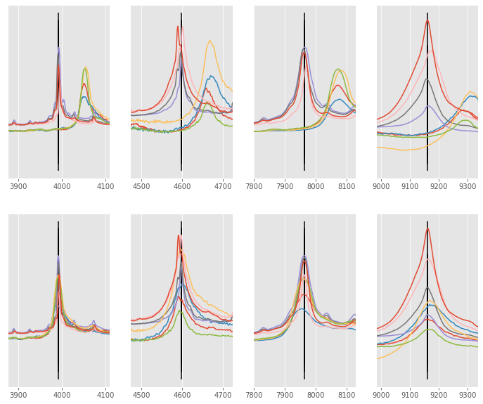
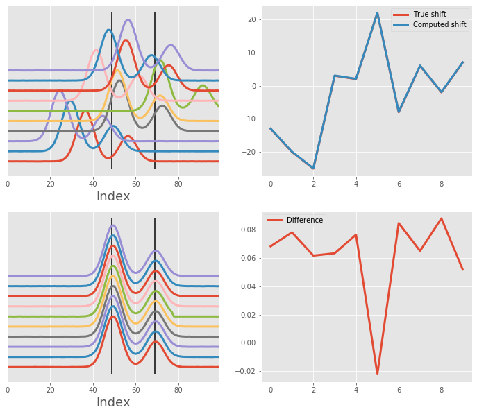

# Welcome

[](https://github.com/lukasz-migas/msalign/actions)
[](https://codecov.io/gh/lukasz-migas/msalign)
[](https://requires.io/github/lukasz-migas/msalign/requirements/?branch=master)
[](https://www.codefactor.io/repository/github/lukasz-migas/msalign)
[](https://app.netlify.com/sites/msalign/deploys)

[](https://pypi.org/project/msalign/)
[](https://pypi.org/project/msalign/)
[](https://pypi.org/project/msalign/)
[](https://pepy.tech/project/msalign)

This package was inspired by MATLAB's [msalign](https://mathworks.com/help/bioinfo/ref/msalign.html) function which
allows alignment of multiple signals to reference peaks.

## Quick installation

```python
pip install msalign
```

## Quick usage

```python
import numpy as np
from msalign import msalign


filename = r"./example_data/msalign_test_data.csv"
data = np.genfromtxt(filename, delimiter=",")
x = data[1:, 0]
array = data[1:, 1:].T
peaks = [3991.4, 4598, 7964, 9160]

aligned = msalign(x, array, peaks, weights=[60, 100, 60, 100], only_shift=False)
```



Zoom-in on each peak the spectrum was aligned against



## Example alignment

In the [Examples](examples/msalign-mass-spectrum.md) you will find a couple of examples that showcase the performance of `msalign`
against synthetic and real examples.

