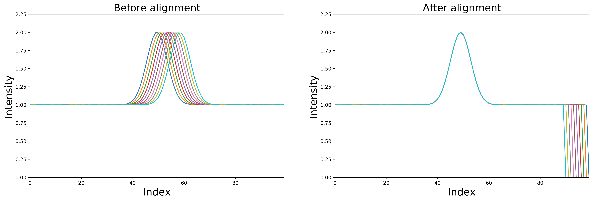

# Usage

Usage is relatively straightforward. Simply import the function `msalign` from the package and provide `xvals`, `zvals`
and `peaks`. Other parameters can be passed-in using `kwargs`.

## Synthetic example

You can quite simply generate synthetic example. Below, I am generating a Gaussian signal (with tiny amount of noise) which
is aligned based on a single peak. In this example, the first signal in the 2D array (`synthetic_signal`) is the correct signal
to which we want to align and everything else is 'shifted' by an arbirtary amount (`shifts`).

```python
import numpy as np
from scipy import signal
from scipy.ndimage import shift
import matplotlib.pyplot as plt
from msalign import msalign


# generate synthetic dataset
n_points = 100
n_signals = 5
noise = 1e-3
shifts = np.arange(1, n_signals)
xvals = np.arange(n_points)

# the first signal is 'real' and we should align to that
synthetic_signal = np.zeros((n_signals, n_points))
synthetic_signal[0] = signal.gaussian(n_points, std=4) + np.random.normal(0, noise, n_points)

# determine the major peak by which msalign should align
alignment_peak = synthetic_signal[0].argmax()

# apply shift pattern
for i in range(1, n_signals):
    synthetic_signal[i] = shift(signal.gaussian(n_points, std=4), shifts[i - 1]) + np.random.normal(0, noise, n_points)

# plot signals that have not yet been aligned
plt.figure()
for i in range(synthetic_signal.shape[0]):
    plt.plot(xvals, synthetic_signal[i])
plt.show()

# align using msalign
synthetic_signal_shifted = msalign(xvals, synthetic_signal, [alignment_peak])

# plot signals that have been aligned
plt.figure()
for i in range(synthetic_signal_shifted.shape[0]):
    plt.plot(xvals, synthetic_signal_shifted[i])
plt.show()
```



!!!note
As you can see, the signals that were shifted have values that go to 0
intensity. Rather than extrapolating, values that are returned as `nan` by the
interpolator are replaced with 0s.

## Noisy synthetic example

If your data is a bit more noisy (as most real dataset would be), you can also easily align it using `msalign`. In this example I simply
change the value of `noise` from `1e-3` to `1e-1`.


## Mass Spectrometry example

You can try-out the example that is used in MATLAB documentation. Simply download it from the [msalign GitHub page](https://github.com/lukasz-migas/msalign/raw/master/example_data/msalign_test_data.csv)

```python
import numpy as np
from msalign import msalign


fname = r"./example_data/msalign_test_data.csv"
data = np.genfromtxt(fname, delimiter=",")
xvals = data[1:, 0]
zvals = data[1:, 1:].T

peaks = [3991.4, 4598, 7964, 9160]
kwargs = dict(
    iterations=5,
    weights=[60, 100, 60, 100],
    resolution=100,
    grid_steps=20,
    ratio=2.5,
    shift_range=[-100, 100],
    only_shift=False,
    )

zvals_new = msalign(xvals, zvals, peaks, **kwargs)
```

<iframe  
    width="825"
    frameborder="0"
    height="850"
    src="../img/mass_spectrum_before_and_after_alignment.html"
    style="background: #FFFFFF;"
></iframe>
